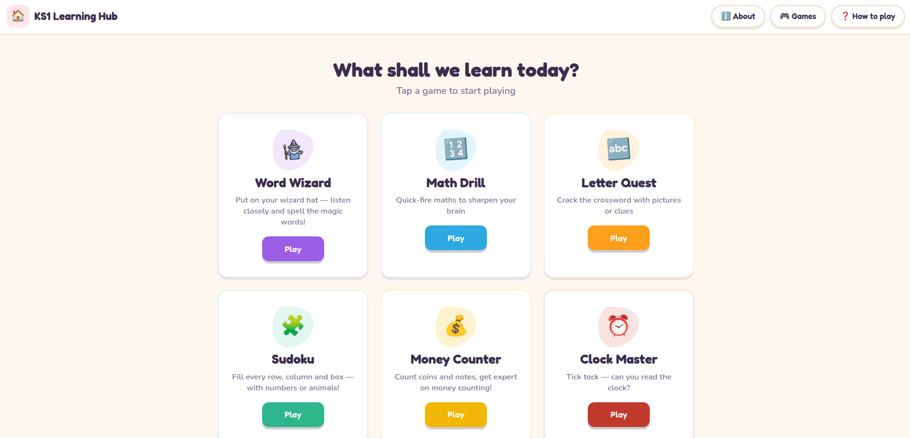
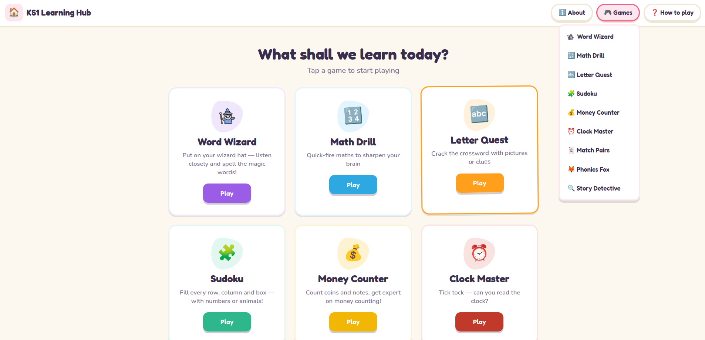
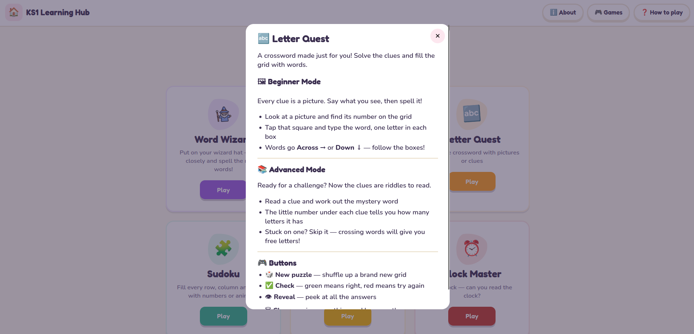
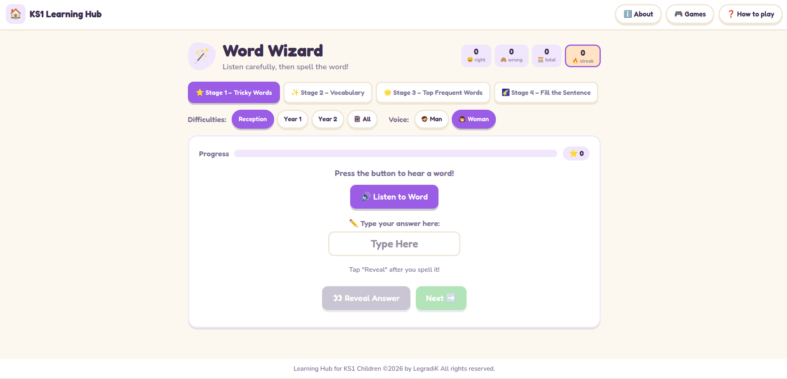

# 🎈 KS1 Learning Hub

**Little games for big learning** — a collection of free, curriculum-inspired learning games for children aged 4–7 (Reception to Year 2), built with Flask.

🔗 **Live demo:** [ks1-learning-hub.onrender.com](https://ks1-learning-hub.onrender.com/)

<!-- TODO: add a screenshot or short GIF of the hub home page here -->

<!--  -->

---

## ✨ What's inside

Nine games across English, maths and logic — each with level switches (starting as gentle as Reception in some games, up to Year 2 challenges), chunky tap-friendly buttons, instant feedback and stars to earn.

### 📚 English


| Game                  | What children practise                                                                                                    |
| ----------------------- | --------------------------------------------------------------------------------------------------------------------------- |
| 🔍**Story Detective** | Reading comprehension — read a short story and work out the missing words from clues in the text                         |
| 🧙**Word Wizard**     | Listen-and-spell — hear a word (text-to-speech), then spell it, stage by stage (Reception, Year 1 and Year 2 word banks) |
| 🔤**Letter Quest**    | A child-sized crossword for spelling and vocabulary                                                                       |
| 🔊**Sound Sort**      | Phonics — choose the right sound to complete the word                                                                    |
| 🃏**Match Pairs**     | Flip-and-match cards pairing pictures with words — vocabulary and memory                                                 |

### 🔢 Maths & logic


| Game               | What children practise                                           |
| -------------------- | ------------------------------------------------------------------ |
| ➕**Maths Drill**  | Quick-fire sums to build number confidence                       |
| 💰**Coin Counter** | Recognising UK coins and making amounts                          |
| 🕐**Clock Master** | Telling the time on an analogue clock, including draggable hands |
| 🧩**Sudoku**       | Mini picture-sudoku puzzles for logic and careful thinking       |

---

<h2>👀 <wbr>How the page looks like</h2>

How the front page looks like: 

How Game Dropdown looks like: 

How to play popup looks like:  

Game page example - Word Wizard: 

## 🧠 Design principles

- **Practice should feel like play.** Short games, no timers, no pressure — wrong answers just hop back out for another go, and solving on the first try earns three stars.
- **Built for small hands.** Every tappable target is at least 48–52 px, with visible focus rings for keyboard users and `prefers-reduced-motion` support throughout.
- **Answers live on the server.** Games like Story Detective never send correct answers to the browser — the client submits an answer sheet to a checking API, so peeking at DevTools spoils nothing.
- **One design system, many themes.** A single stylesheet drives every game through CSS custom properties: each game swaps `--accent` / `--accent-soft` via a `theme-*` body class, and shared components (jelly buttons, panels, progress bars, score cards) restyle themselves automatically.

---

## 🏗️ Architecture

```
ks1_learning_hub/
├── run.py                     # dev entry point (Flask dev server)
├── requirements.txt
├── app/
│   ├── __init__.py            # app factory + blueprint registration
│   ├── templates/
│   │   ├── base.html          # shared shell: topbar, nav menus, footer
│   │   ├── hub/               # home + about pages
│   │   └── <game>/            # one template folder per game
│   ├── static/
│   │   ├── style.css          # the shared design system
│   │   ├── script.js
│   │   └── other .png files
│   ├── hub/                   # home blueprint
│   └── story_detective/       # each game is a self-contained blueprint:
│       ├── __init__.py        #   blueprint object
│       ├── route.py           #   page + JSON API routes
│       ├── game_logic.py      #   pure-Python game rules (no Flask imports)
│       └── resources/         #   content as data modules
│           ├── year1_stories.py
│           └── year2_stories.py
```

**Key decisions:**

- **App factory + blueprints.** The hub started life as three standalone Flask apps (Letter Quest, Maths Drill, Word Wizard) that were consolidated into one application. Each game is now an isolated blueprint with its own routes, logic and content — adding a game never touches another game's code.
- **Content as data, separate from logic.** Game content (stories, word lists, quizzes) lives in plain-Python resource modules validated at startup. Adding a Story Detective story means appending a dict to a data file — no changes to routes or game logic.
- **Server-side checking.** Game rules live in `game_logic.py` modules that know nothing about Flask, exposed through small JSON APIs (`/api/story/<id>`, `/api/check`). The front end is vanilla JavaScript — no framework, no build step.
- **No database, no accounts, no tracking.** All state lives in the browser for the duration of a game. That keeps the app simple, fast and appropriate for young children.

---

## 🚀 Running locally

Requires **Python 3.12+**.

```bash
git clone https://github.com/LegradiK/ks1_learning_hub.git
cd ks1_learning_hub

python3 -m venv venv
source venv/bin/activate        # Windows: venv\Scripts\activate

pip install -r requirements.txt
python3 run.py
```

Open http://127.0.0.1:5000 and play.

To test on a tablet or phone on the same Wi-Fi, run the server on all
interfaces and visit `http://<your-computer-ip>:5000` from the device:

```bash
flask run --host=0.0.0.0
```

---

## ☁️ Deployment

Deployed on **Render** with **Gunicorn**, auto-deploying from `main` on every push.

- Build command: `pip install -r requirements.txt`
- Start command: `gunicorn -b 0.0.0.0:$PORT -w 2 run:app`
- Python version pinned via `.python-version`

---

## ➕ Adding content (example: a new Story Detective story)

Stories are plain dicts in `app/story_detective/resources/`. Append one to the
right year file and restart — a startup validator catches authoring mistakes
(duplicate ids, an answer missing from its own options) before they reach a child:

```python
{
    "id": "my-new-story",
    "level": 1,
    "emoji": "🌟",
    "title": "My New Story",
    "segments": [
        {"text": "The sun was "},
        {"gap": {"answer": "bright", "options": ["bright", "green", "sleepy"]}},
        {"text": " in the sky."},
    ],
}
```

Distractor guidelines used across the stories: one option is the same word
class with the wrong meaning; one is plausible but contradicted by the story —
so a right answer always proves the child read and understood the text.

---

## 🗺️ Roadmap - what can be implemented in the future

- [ ]  Drag-and-drop word placement in Story Detective (touch + mouse)
- [ ]  More stories and word banks per level
- [ ]  Automated tests for game logic and API routes
- [ ]  Sound effects and celebration animations
- [ ]  Printable activity sheets to pair with the games

---

## 👋 About

Built by **Kaho** ([@LegradiK](https://github.com/LegradiK)) — a Python developer
based in Greater Manchester. Spotted a bug or have an idea for a new game?
[Open an issue](https://github.com/LegradiK/ks1_learning_hub/issues) — I'd love to hear it.
